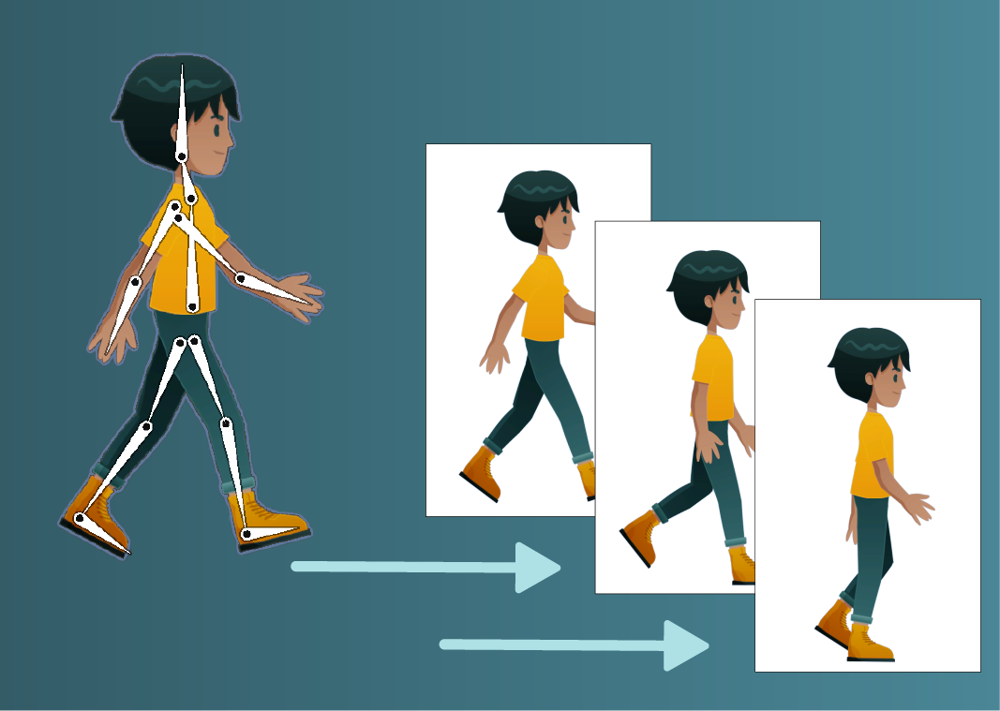

# Unity Tool: Convert Sprite-Bone Animation to Image Sequence Animation

This Unity tool allows you to convert an object with sprite-bone animation into an object with an image sequence animation. It enables easier runtime management and can help reduce performance costs associated with skeletal animations.



## Table of Contents
- [Unity Tool: Convert Sprite-Bone Animation to Image Sequence Animation](#unity-tool-convert-sprite-bone-animation-to-image-sequence-animation)
  - [Table of Contents](#table-of-contents)
  - [Features](#features)
  - [Getting Started](#getting-started)
    - [Prerequisites](#prerequisites)
    - [Installation](#installation)
  - [Usage](#usage)
  - [Contributing](#contributing)
  - [Contact](#contact)

## Features
- **Automated Conversion**: Easily convert sprite-bone animations to image sequences.
- **Performance Optimization**: Image sequence animations are often lighter on the CPU, making them ideal for mobile and high-performance games.
- **User-Friendly Interface**: Simple UI within the Unity Editor for quick and easy conversion.

## Getting Started
Follow these instructions to integrate and use the tool in your Unity project.

### Prerequisites
- Unity 2022.3 or later (may vary based on compatibility)
- Basic knowledge of Unity's Animation system and Sprite Editor

### Installation
1. Download or clone this repository:
    ```bash
    git clone https://github.com/sily-patel/2DAnimationConverter.git
    ```
2. This tool can be opened as a Unity project directly or integrated into your existing project by copying the `Editor` folder into your project's `Assets/Editor` folder.
3. After the import is complete, you should see the tool available in the Unity Editor.

## Usage


1. Open the Unity Editor and locate the **Convert Sprite-Bone to Image Sequence** tool under `Window > Tools > 2D Animation Converter`.
2. Prepare a Camera for capture:
   - Select a camera and assign it to the **Target Camera** field. This camera will have an output texture that will be converted into images.
   - In the Camera settings, under **Environment**, set **Background Type** to *Solid Color*, and set the alpha channel of the color to zero for a transparent background.
3. Select the GameObject with the sprite-bone animation you wish to convert, and assign it to the **Character Object** field.
4. Select the desired output image size from the range (32x32 to 4096x4096).
5. Click **Preview** to ensure the character fits within the camera bounds.
6. Click **Convert to Image Sequence**. The tool will gather necessary information from the animation clip, then process each frame of the sprite-bone animation and generate an image sequence.
7. Click **Force Stop Task** if you need to stop the process.
8. The converted image sequence will be saved in a designated folder within your project assets, along with a new prefab, sprite atlas, animation controller, and animation clip.
9. Use the newly created prefab in your game to replace the original GameObject.
10. When you convert again, the tool will replace the previously created prefab with the updated animation controller and animation clip, so you don’t need to manually update each prefab in your game scenes.

## Contributing
Contributions are welcome! If you find a bug or have a feature request, please open an issue. To contribute:
1. Fork the repository.
2. Create a new branch (`feature/my-feature`).
3. Commit your changes.
4. Push to the branch.
5. Open a pull request.

## Contact
For questions, reach out to me, [Sahil Patel](https://www.linkedin.com/in/sahil-patel-6ba064270) (sahil.patel.no3@gmail.com).

---

Thank you for using this tool! I hope it simplifies your animation process in Unity.
